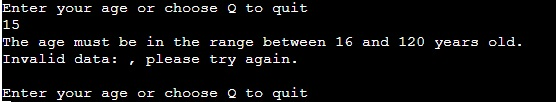
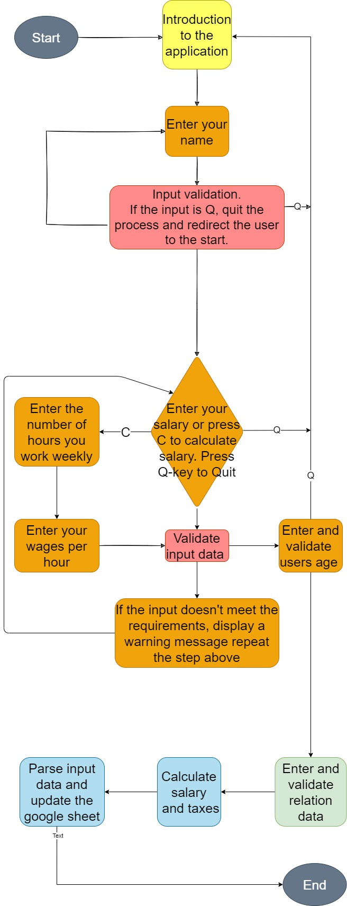

# Mini Tax Calculator.

## Welcome to my Project! 

The subject of the project is a Tax Calculator. The purpose of the project is to create 
a simple and easy calculator for calculating income taxes based on the Irish Revenue system.

## Features

The application calculates the weekly tax. Which means that all input data should also base on the weekly period.

After the application starts it asks the user for some details that are required for the tax to be calculated.
- **Name:** The first question is about the users name. This information is only needed for identification the user.
- **Salary:** Salary is the main factor tax calculation is based on. 
  * **Enter Salary:** The salary can be entered directly by writting its numeric, float value in the terminal, or 
    in a case that the user doesn't know it, it can be calculated.
  * **Calculate Salary:** To calculate salary the option "C" has to be chosen. Then a set of two question will be asked:
    A question about the hourly rate and the number of hours worked. The salary is calculated by multiplication the hourly rate and the number of hours
  * **Validation:** The next step is validation that follows after the salary is either entered or calculated. The validation check if the salary doesn't contain invalid symbol or negative numbers.
- **Age:** Although there is no minimum age at which you are liable to pay taxes, only people 16 uears old or older can be employed for full time work. That is why the application asks for this information. Validation function refuses any input that is lower than 16 and higher than 120 years old.
    
- **Marriage/Partnership:** The main factor for calculating Tax Credit. Returns boolean value.
- **Tax Calculation:** The main functionality of this application. Calculates the Taxes value based on Irish Revenue system, it uses following factors:
  * **Tax Credit:** Tax relief. Dependend on marital status.
  * **USC:** Universal Social Charge.
  * **PRSI:** Pay Related Social Insurance.
  * **Final Tax:** Calculates the sum of all taxes.
- **Update Google Sheet:** The last functionality, that allows the user to send and archive his result.

 
## Future Features
  - Searching and displaying users data from google sheet.
  - Calculating other type of taxes such as Capital Gains Tax.

## Technologies used:
  
 - **Python** - an interpreted, object-oriented, high-level programming language
 - **Google Sheets** - A web-based application that enables users to create, update and modify spreadsheets and share the data online in real time.

## Unfixed buds:

## Testing
<!-- Every page in this project was validation tested and it is responsive for every type of devices from desktop computers to mobile phone screen.
More details about tesings are available in the separate testing section [here](testing.md) or in the dedicated file testing.md -->

## Deployment

Code Institute has provided a [template](https://github.com/Code-Institute-Org/python-essentials-template) to display the terminal view of this backend application in a modern web browser. This is to improve the accessibility of the project to others.

The live deployed application can be found at [Mini Tax Calculator](https://mini-tax-calculator.herokuapp.com/).

### Local Deployment

*Gitpod* IDE was used to write the code for this project.

To make a local copy of this repository, you can clone the project by typing the follow into your IDE terminal:
- `git clone https://github.com/TomaszWoloszyn983/mini-tax-calculator.git`

Alternatively, if using Gitpod, you can click below to create your own workspace using this repository.

### Heroku Deployment

This project uses [Heroku](https://www.heroku.com), a platform as a service (PaaS) that enables developers to build, run, and operate applications entirely in the cloud.

Deployment steps are as follows, after account setup:

- Select *New* in the top-right corner of your Heroku Dashboard, and select *Create new app* from the dropdown menu.
- Your app name must be unique, and then choose a region closest to you (EU or USA), and finally, select *Create App*.
- From the new app *Settings*, click *Reveal Config Vars*, and set the value of KEY to `PORT`, and the value to `8000` then select *add*.
- Further down, to support dependencies, select *Add Buildpack*.
- The order of the buildpacks is important, select `Python` first, then `Node.js` second. (if they are not in this order, you can drag them to rearrange them)

Heroku needs two additional files in order to deploy properly.
- requirements.txt
- Procfile

You can install this project's requirements (where applicable) using: `pip3 install -r requirements.txt`. If you have your own packages that have been installed, then the requirements file needs updated using: `pip3 freeze --local > requirements.txt`

The Procfile can be created with the following command: `echo web: node index.js > Procfile`

------------------ !!!!!!!!!!!!!!!!!!! ------------------- !!!!!!!!!!!!!!!!!!!!!!!!! ---------------------
IMPORTANT SECTION YOU MUST UPDATE !!!!!!!!!!!!!!!!
If you are using an API like Google Sheets, then you must also include the instructions on how someone can obtain their own API/Credentials.
Advise how they can get their own, steps necessary to get one, and then creating the creds.json file or env.py file and pasting in their keys.
Also on Heroku config vars, which variable key/value is also needed to get it working on Heroku
END OF IMPORTANT EXTRA SECTION !!!!!!!!!!!!!!!!!!!
To create users own Google Sheet following steps must be taken.
 - Create an account on Google Cloud Platform.
 - Open new project.
 - Choose APIs and Services option and click Library.
 - Enable two APIs: 
    * Google Drive Api that provides credentials for security access.
      Select Create Credential option and create credentials for the application data. 
      Create Service account, name it, mark as Editor (or owner) and select the JSon option. Click continue to download the credential file to your computer.
    * Google Sheet allows to create you own sheet where your data can stored and analized.
------------------ !!!!!!!!!!!!!!!!!!! ------------------- !!!!!!!!!!!!!!!!!!!!!!!!! ---------------------

For Heroku deployment, follow these steps to connect your GitHub repository to the newly created app:

- In the Terminal/CLI, connect to Heroku using this command: `heroku login -i`
- Set the remote for Heroku: `heroku git:remote -a <app_name>` (replace app_name with your app, without the angle-brackets)
- After performing the standard Git `add`, `commit`, and `push` to GitHub, you can now type: `git push heroku main`

Alternatively, you can enable Automatic Deployments from within the Heroku app, by connecting it to your GitHub repository.

The frontend terminal should now be connected and deployed to Heroku.

## References and Credits:

## Credits:
<!-- I would like to especially thank to Tim Nelson from Code Institute for his great support. -->