# Code validation. 
* The application were passed through the  [Pep8 validator:](http://pep8online.com/) with result of no errors detected.

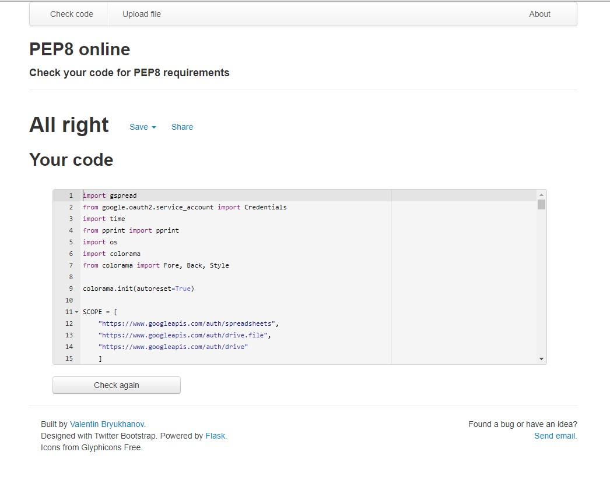

# Functionality Testing

## 1. get_name function testing:

* The entered value is passed to the validation function. 
    - If the validation succeeds the user is expected to be move to the next step.
    - If the validation doesn't succeeds the the user is redirected back.

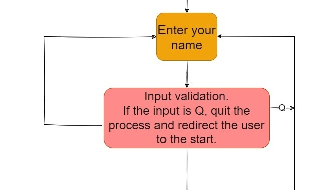

* Example of valid value:

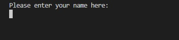

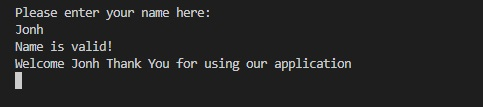

* Examples of invalid values:

Invalid input is refused by validator and the application repeats the request as many times as the validation succeeds.

Inputs that are too short, integers, empty inputs or any symbols other than lower and uppercase letter are refused.

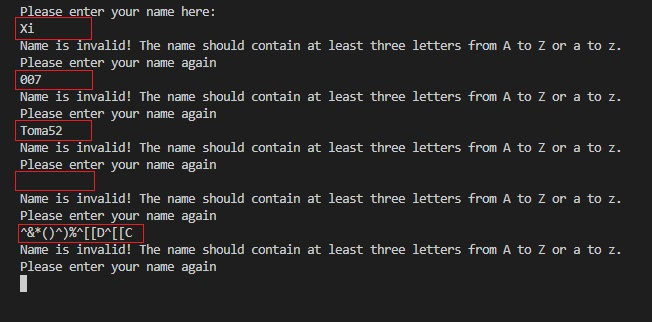

## request_salary function testing:

Strings, empty string or input containing string or letters are refused by the validator. 
Also zero or negative numbers are refused.

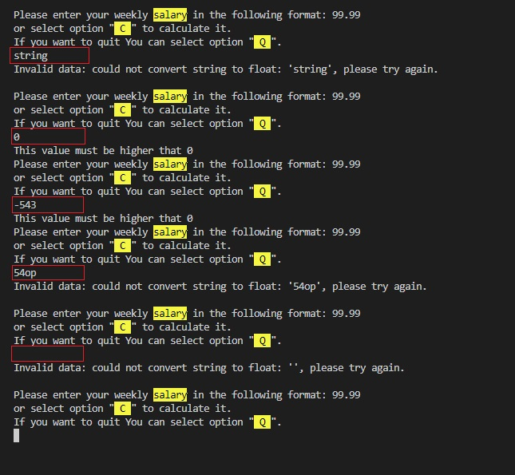

Float and integer input are allowed: number such as 123 or 123.45.

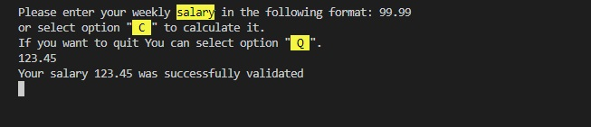

Also Float numbers as 123.456789 are accepted by the validator.
The validation function rounds such a numbers to the correct format: 123.45

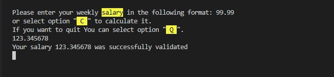

#### calculate_salary function testing
After selection option "C" the user can calculate the salary by entering his hourly rate and number of working hours.
The function is secured from inputing any negative values.

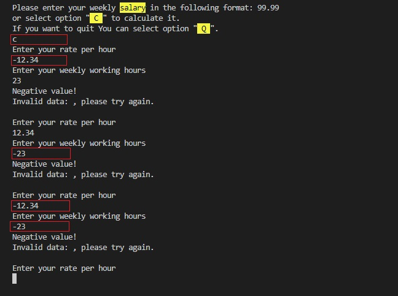

Only positive numbers are allowed.

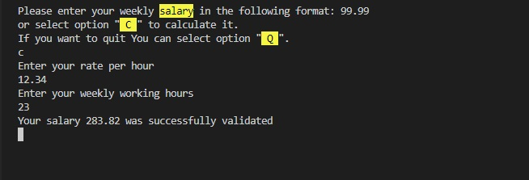

## get_age function testing

This function is secured from inputing any string or empty string values.

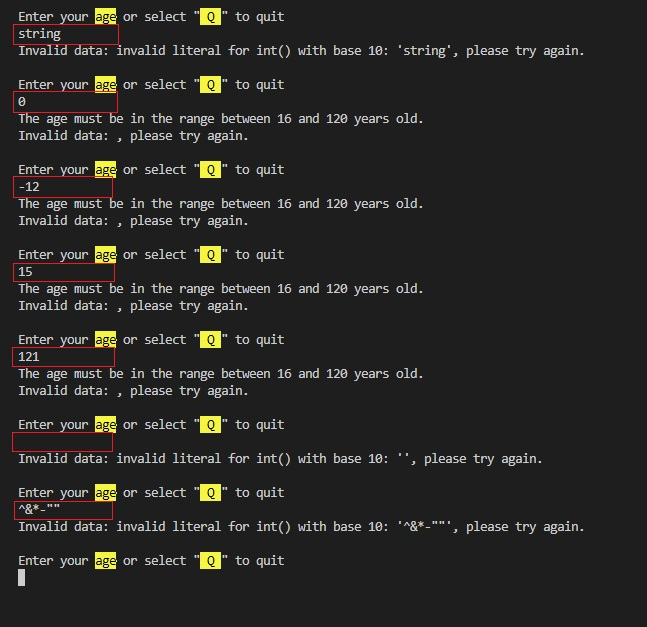

Also only numbers in range from 16 to 120 are allowed.

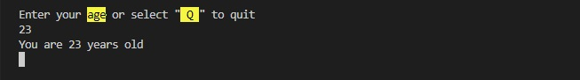

## is_married function testing

Function is_married takes agruments yes or no.
It refuses any string that are not "Y", "y" or "N", "n" empty strings, integers, or any other values.

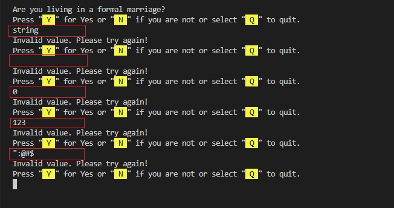

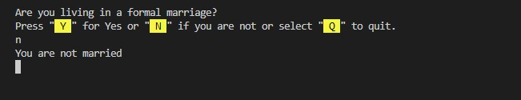

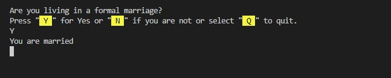

However the validation accepts also any string that start at letter n or letter y and interpretes then as "no" or "yes"

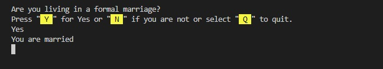

## quit function testing

After selection option Q for quit the user is asked for submiting his choice.
He can only enter lower or uppercase "y" or "n". 

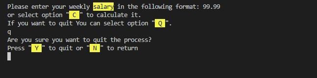

Any other values are not allowed and they cause the question will be repeated.

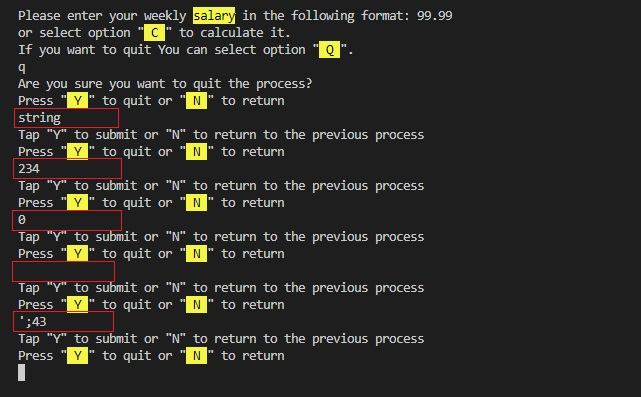

If the user enters "Y" to submit he will be moved to the first question wich is question for the name:
If the user enters "N" for no he will be returned to the previous question.

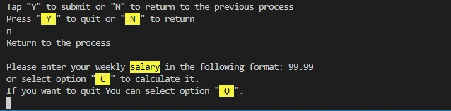

## submit function testing

Submit function accepts only "Y" or "N" input in upper and lowercase.

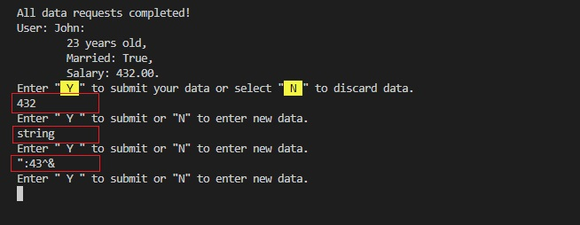

Submiting data causes that tax calculating function are lauched and the data are sent ot the google sheet.

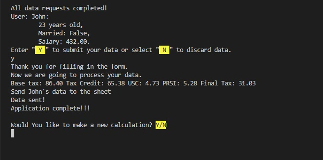

## update_sheet function testing

Function successfully sends calculated data to google sheet.

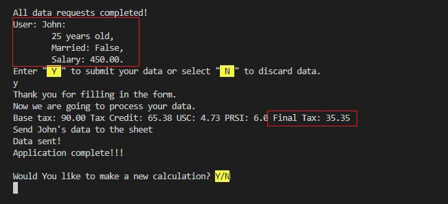

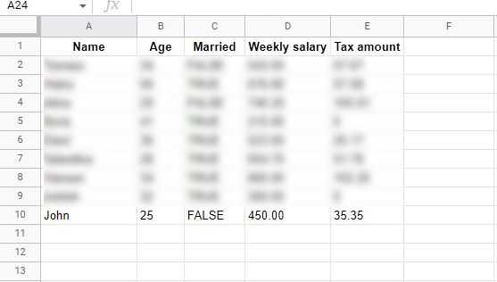

# Bugs and Error
### The following bugs and error were encountered during or after the development process.

* There was an unhandled edge case in the calculate_salary function that led to incorrect assigning the value of the salary variable. 

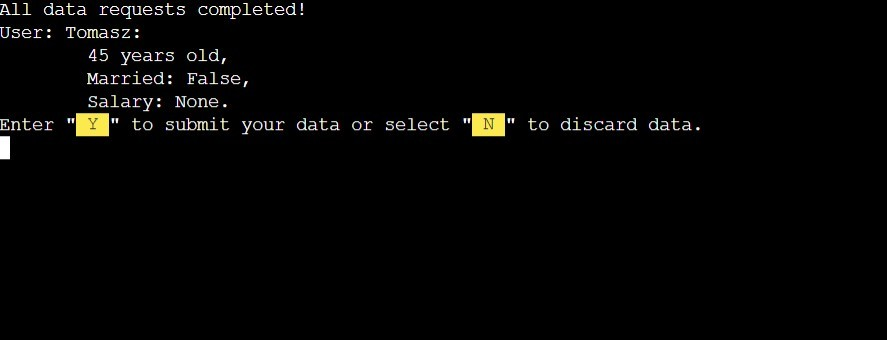

In the result that caused stopping the application and displaying the error message. 

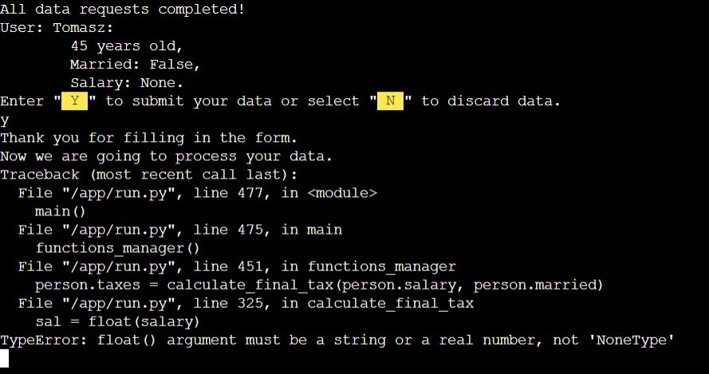

The reason of occuring the error was the line 165, where returning value of the calculate_salary() function wasn't assigned to any variable. 

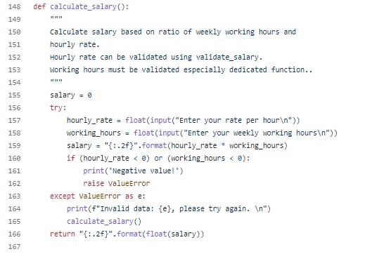

After assigning the functions value to the variable salary, the salary variable was correctly returned in the return statement of the function.
