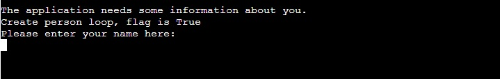
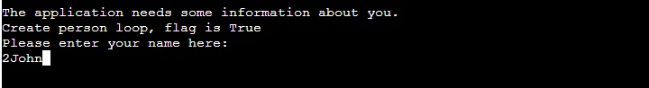
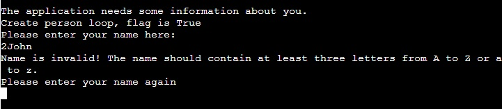
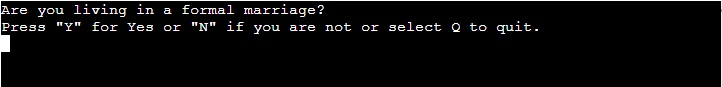
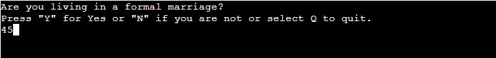
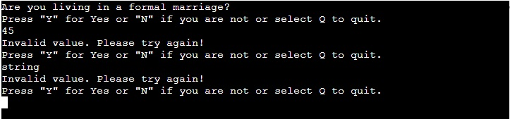

* Code validation: [Pep8 validator:](http://pep8online.com/)

* Testing reaction to entering an invalid users name:

Enter invalid input:

Invalid input is refused by validation and the application repeats the name request.

* Testing reaction to entering an invalid users input:

Enter invalid input:

Invalid input is refused by validation and the application repeats the request as many times as the validation succeeds.

